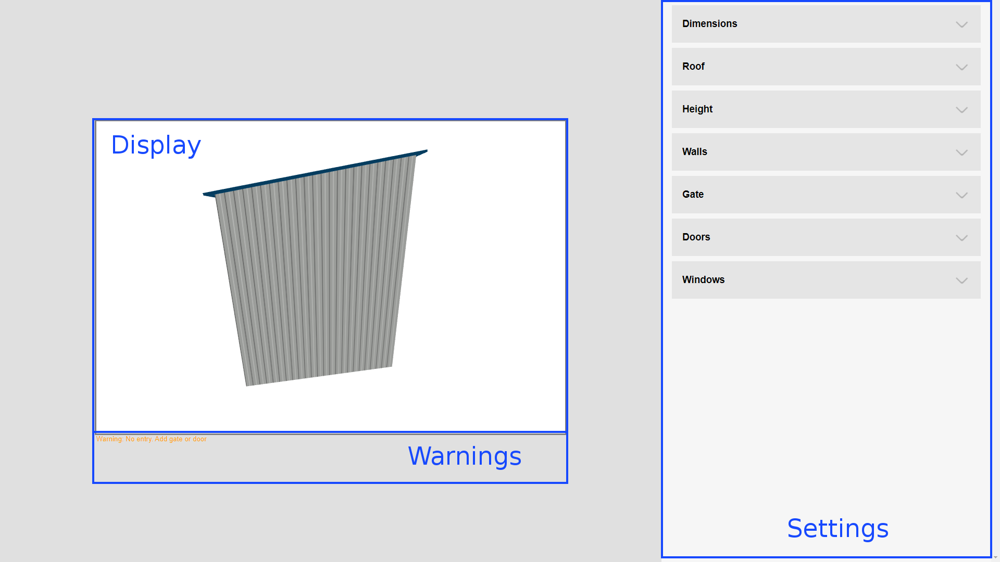

# Garage Configurator

Application allows user to design a garage. Real-time visualisation in connection with long list of settings makes a process fun and simple.

Live example: https://marcsikora.github.io/projects/garage-configurator/

Below is a preview that helps understand how program works.

## Preview

https://user-images.githubusercontent.com/93472358/142784166-7e130c54-279c-41e4-9ed2-058d5b8c781c.mp4

## Structure

**Display** - shows garage visualisation in real-time

**Settings** - list of editable parameters that change visualisation

**Warnings** - list of warnings about garage structure

## Display

Display enables user to view garage from different perspectives. Use LMB to move around and scroll to zoom in/out

## Settings

| Parameter name | Description |
|----------------|-------------|
| Width | garage width |
| Length | garage length |

| Parameter name | Description |
|----------------|-------------|
| Roof type | type of roof |
| Material type | type of roof's material |
| Color | color of roof's material |

| Parameter name | Description |
|----------------|-------------|
| Minimal | minimal roof height |
| Maximal | maximal roof height |

| Parameter name | Description |
|----------------|-------------|
| Material type | type of walls material |
| Color | color of walls material |

| Parameter name | Description |
|----------------|-------------|
| Gate type | type of gate |
| Gate position | position of gate |
| Material type | type of walls material |
| Color | color of walls material |
| Width | gate's width |
| Length | gate's length |

| Parameter name | Description |
|----------------|-------------|
| Doors count | amount of doors |
| Wall | wall on which door is placed |
| Position | door's position |
| Material type | type of door's material |
| Color | color of door's material |

| Parameter name | Description |
|----------------|-------------|
| Windows count | amount of windows |
| Type | determines window's dimensions |
| Wall | wall on which window is placed |
| Position horizontally | windows's horizontal position |
| Position vertically | windows's vertical position |

## Warnings

List of possible warnings:

*"Gate width is bigger than garage width"*

*"Gate height is bigger than garage minimum height"*

*"No entry. Add gate or door"*

*"Minimum height is bigger than maximum height"*

*"Door is overlapping with gate"*

*"Door is overlapping with window"*

*"Doors are overlapping"*

*"Window is overlapping with gate"*

*"Windows are overlapping"*

*"Door is outside garage"*

*"Windows is outside garage or too close to roof"*
